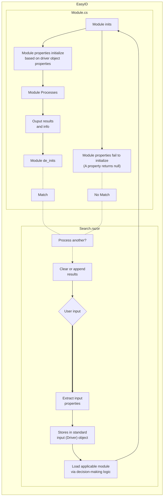
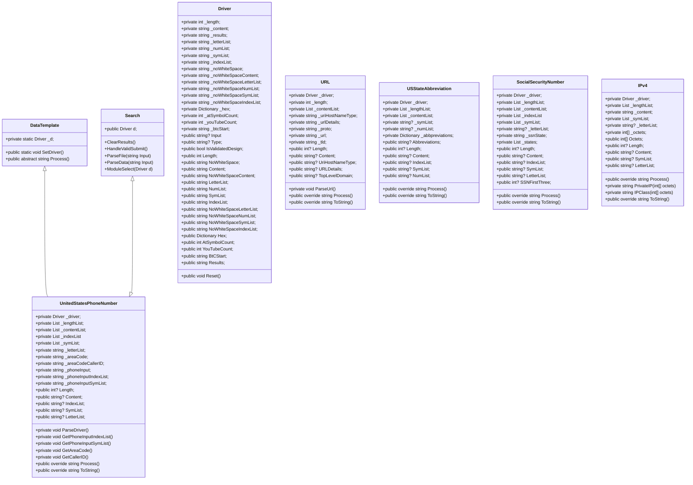

# EasyID
EasyID is a tool that launches a local web server. The server hosts a search bar that accepts user input and attempts to identify what a piece of data is. It accepts either a singular data string, or a file full of potential data strings as input. If there is a match, it outputs to the screen what it has identified on, and any extra details about the data. Example: 630-111-2222 matches on phone number and extrapolates an Illinois area code.

### Program Flow

### Class Diagram

