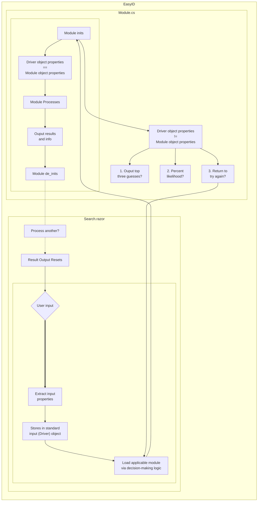
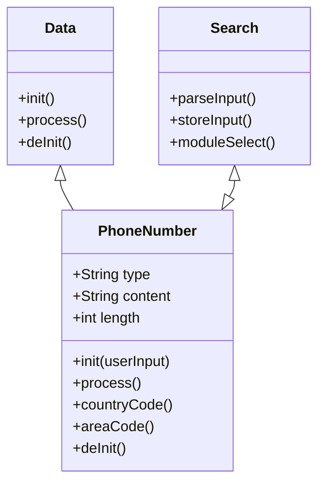

# project

### Program Flow

```mermaid
flowchart LR
subgraph EasyID
  subgraph Search.razor
  direction TB
    subgraph  
      direction TB
        A{User input} =====> B[Extract input\nproperties] --> Z["Stores in standard\ninput (Driver) object"] --> Y[Load applicable module\nvia decision-making logic]
    end
   M[Process another?]
   Q[Result Output Resets]
  end
  subgraph Module.cs
    direction TB
    subgraph  
      direction TB
        D[Module inits] --> E[Driver object properties \n==\n Module object properties] --> G[Module Processes] --> H[Ouput results\nand info] --> I[Module de_inits]
    end
    D --> F[Driver object properties \n!=\n Module object properties]
    F --> J[1. Ouput top\nthree guesses?] & K[2. Percent\nlikelihood?] & L[3. Return to\ntry again?]
  end
I -.- M -.-> Q --> A
L --> Y
Y --> D
end
```

### Class Diagram

```mermaid
classDiagram
    Data <|-- PhoneNumber
    Search <|--|> PhoneNumber
    
    Data : +init()
    Data : +process()
    Data : +deInit()
    
  class Search {
    +parseInput()
    +storeInput()
    +moduleSelect()
  }
  
  class PhoneNumber {
    +String type
    +String content
    +int length
    +init(userInput)
    +process()
    +countryCode()
    +areaCode()
    +deInit()
  }
```
